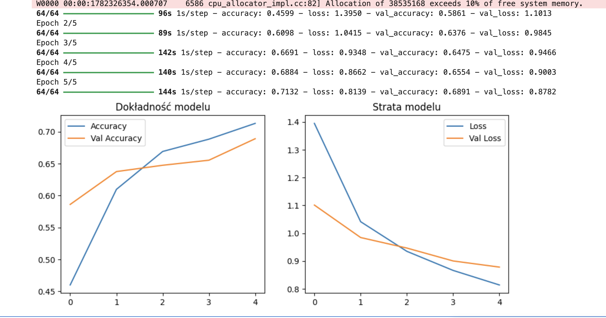

# Intelligent Waste Classifier with Explainable AI 

A Cloud-Native Machine Learning system developed to automate waste sorting. This project combines **Computer Vision**, **Transfer Learning**, and **Explainable AI** to classify trash into 6 categories while visualizing the neural network's decision-making process in real-time.

---

## 📊 Project Overview
This project was developed for a Machine Learning course using the **AWS Academy Learner Lab** environment. The system allows users to hold trash items up to a webcam and receive an instant classification along with a visual heatmap showing exactly what the AI is "looking at."

### Key Results
*   **Accuracy:** ~71% on training data / ~67% on validation data.
*   **Model:** MobileNetV2 (Pre-trained on ImageNet).
*   **Deployment:** Amazon SageMaker & Gradio Live Interface.



---

## 🚀 Technical Architecture

### 1. Cloud Infrastructure (AWS)
*   **Amazon S3:** Used as a Data Lake to store and serve the dataset of 2,500+ images.
*   **Amazon SageMaker:** Utilized `ml.t3.medium` instances for model training and hosting the inference notebook.

### 2. Deep Learning Pipeline
*   **Transfer Learning:** We used **MobileNetV2** as a feature extractor. This architecture is optimized for mobile and CPU environments, providing low latency for live demos.
*   **Fine-tuning:** We froze the base layers to retain general visual knowledge and trained a custom classification head for our 6 specific waste categories.
*   **Optimization:** Trained for 5 epochs using the **Adam optimizer** and **Sparse Categorical Crossentropy** loss.

### 3. Explainable AI (Grad-CAM)
To solve the Black Box problem, we implemented **Grad-CAM** (*Gradient-weighted Class Activation Mapping*). 
*   It generates a **Heatmap** overlaid on the original image.
*   **Red zones** indicate high neural activation (the most important features).
*   This allowed us to verify that the model focuses on the object's texture and edges rather than the background or the user's face.

---

## 🔍 Edge Case Analysis & Findings
One of the most valuable parts of this project was analyzing where the model struggled:
*   **Domain Shift:** The model was trained on studio-style photos (white backgrounds) but tested in a real room. This led to a drop in confidence when the background was cluttered.
*   **The "Chocolate Wrapper" Case:** Shiny plastic wrappers were often classified as **Metal**. This proves the Grad-CAM works—the model correctly identified the metallic reflections and textures common in the "Metal" training class.
*   **Paper vs. Cardboard:** Flat sheets of paper were sometimes classified as **Cardboard** due to the rigid edges and flat planes, which the model associates with box structures.

---

## 🛠️ Installation & Usage

1.  **Environment:** Open the `Klasyfikacja_Odpadow_AWS.ipynb` in AWS SageMaker or JupyterLab.
2.  **Dependencies:**
    ```bash
    pip install gradio tensorflow opencv-python pillow
    ```
3.  **Run:** 
    *   Skip the training cells if you have the `.h5` file.
    *   Run the **Load Model** cell to import `model_odpady_final.h5`.
    *   Execute the **Gradio Interface** cell to generate the `.gradio.live` link.

---

## Possible Future Improvements
*   **Data Augmentation:** Implement rotations and flips to reduce sensitivity to camera angles.
*   **Hybrid Detection:** Integrate a YOLOv8 detector to crop the object before passing it to the classifier.
*   **Fine-tuning:** Unfreeze deeper layers of MobileNetV2 to specialize the filters for waste textures.
